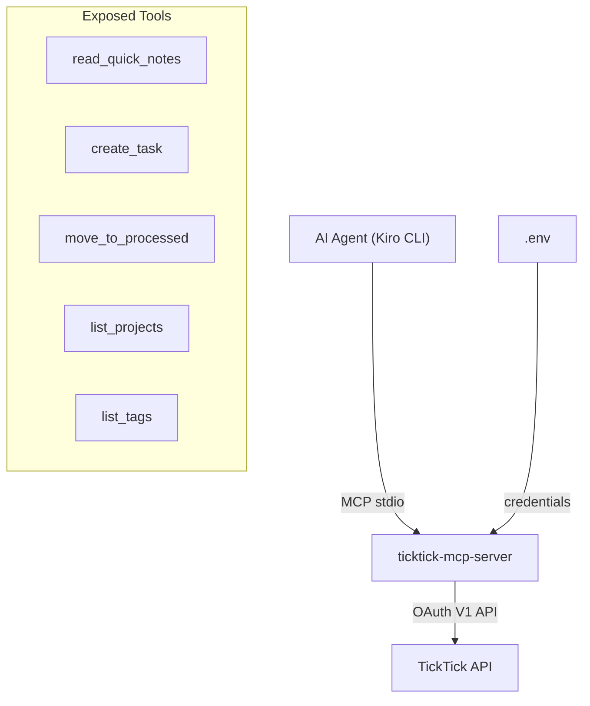

# TickTick MCP Server — Implementation Plan

## Problem Statement

Build a secure Python MCP server that gives an AI agent controlled access to TickTick. The AI must never read the server code or credentials. Only specific, safe operations are exposed.

## Security Constraints

- AI can only run the server, never read source or credentials
- Allowed operations: read Quick Notes, create tasks (with tags), list projects, list tags, move notes to Processed
- NO delete, NO update, NO reading from arbitrary lists
- All write operations validated against a project excludelist (all projects allowed by default, specific ones blocked)
- Credentials stored outside the AI's accessible filesystem

## Architecture



## Tech Stack

- Python 3.10+
- `mcp[cli]` SDK (FastMCP, stdio transport)
- `httpx` for HTTP calls
- `pydantic` for schemas
- `python-dotenv` for credentials
- `uv` as package manager
- One-command startup: `uv run python src/server.py`

## Environment Variables (.env)

```
TICKTICK_CLIENT_ID=
TICKTICK_CLIENT_SECRET=
TICKTICK_ACCESS_TOKEN=
TICKTICK_REFRESH_TOKEN=
QUICK_NOTES_PROJECT_ID=
PROCESSED_PROJECT_ID=
EXCLUDED_PROJECTS=
```

## Task Breakdown

### Task 1: Project scaffolding and ping tool

**Objective:** Create project structure with a working MCP server that responds to ping.

**Implementation:**
- `uv init`, add dependencies: `mcp[cli]`, `httpx`, `pydantic`, `python-dotenv`
- Create `src/server.py` with `FastMCP("ticktick")` and a `ping` tool
- Add `.env.example` with all required variables
- Add README with one-command run instruction

**Test:** Run `uv run mcp dev src/server.py`, call `ping`, get "pong".

**Demo:** Server starts with one command, responds via MCP inspector.

---

### Task 2: OAuth authentication module

**Objective:** Handle OAuth token storage, refresh, and initial authorization flow.

**Implementation:**
- Create `src/auth.py` — loads `.env`, stores tokens in local `tokens.json`
- One-time CLI command: `uv run python src/auth.py` opens browser for OAuth
- Token refresh on expiry using `httpx`
- Auth URL: `https://ticktick.com/oauth/authorize`
- Token URL: `https://ticktick.com/oauth/token`
- Scopes: `tasks:read`, `tasks:write`

**Test:** Run auth flow → tokens saved → subsequent runs use stored token.

**Demo:** `uv run python src/auth.py` → browser → authorize → tokens saved.

---

### Task 3: `list_projects` tool

**Objective:** Read-only tool returning all TickTick projects (id + name).

**Implementation:**
- Create `src/ticktick.py` — thin API client wrapping `httpx` calls to `https://api.ticktick.com/open/v1/project`
- Expose via `@mcp.tool()` in `server.py`
- Return list of `{id, name}` objects

**Test:** Call via MCP inspector, confirm real projects appear.

**Demo:** AI sees all available project names and IDs.

---

### Task 4: `read_quick_notes` tool

**Objective:** Read tasks from the Quick Notes project only.

**Implementation:**
- Use `QUICK_NOTES_PROJECT_ID` from env
- Call `/project/{id}/data` endpoint
- Return task titles + IDs only
- Refuse requests for any other project

**Test:** Add a note in TickTick Quick Notes, call tool, confirm it appears.

**Demo:** AI sees exactly what's in Quick Notes, nothing else.

---

### Task 5: `create_task` tool

**Objective:** Create tasks in approved projects with metadata.

**Parameters:**
- `title` (required) — string
- `project_name` (required) — string, must not be in EXCLUDED_PROJECTS
- `due_date` (optional) — ISO date string
- `priority` (optional) — 0/1/3/5
- `tags` (optional) — list of strings

**Implementation:**
- Resolve project name to ID using cached project list
- Validate project is NOT in excludelist, reject otherwise
- POST to `/task` endpoint
- Update local `tags.json` if new tags are used

**Test:** Create task via inspector, confirm in TickTick with correct project/tags.

**Demo:** Create "Make CV more beautiful" in project "cv" with tag "career".

---

### Task 6: `list_tags` tool

**Objective:** Return existing tags so AI uses them rather than inventing new ones.

**Implementation:**
- Maintain `tags.json` in server directory
- Updated automatically when `create_task` uses a new tag
- Seed manually or from initial task scan on first run
- Return sorted list of tag strings

**Test:** Call tool, see tags. Create task with new tag, call again, see it added.

**Demo:** AI sees ["career", "social", "health"] and picks from existing.

---

### Task 7: `move_to_processed` tool

**Objective:** Move a Quick Note to the Processed project after triage.

**Parameters:**
- `task_id` (required) — string

**Implementation:**
- Validate task belongs to Quick Notes project (fetch and check `projectId`)
- POST update changing `projectId` to `PROCESSED_PROJECT_ID`
- Reject if task isn't from Quick Notes

**Test:** Create quick note, move via tool, confirm in Processed project.

**Demo:** After triage, "Make CV beautiful" moves from Quick Notes → Processed.

---

### Task 8: Security hardening

**Objective:** Enforce security boundaries regardless of what the AI requests.

**Implementation:**
- Excludelist validation on all write operations (all projects allowed unless explicitly excluded)
- Audit log (`audit.log`) for all operations with timestamp + parameters
- Rate limiting: max 50 operations per session
- `--dry-run` flag for testing (logs without calling TickTick)
- No tool exposes file reading, code access, or arbitrary API calls
- Graceful error messages (no stack traces or credential leaks)

**Test:** Create task in excluded project → rejected. Check audit log after session.

**Demo:** Audit log shows full session history. Excluded project operations fail gracefully.
